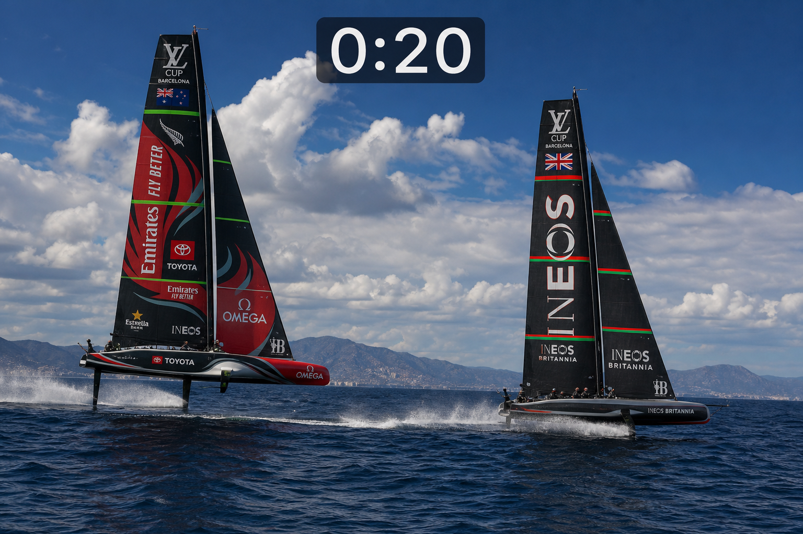
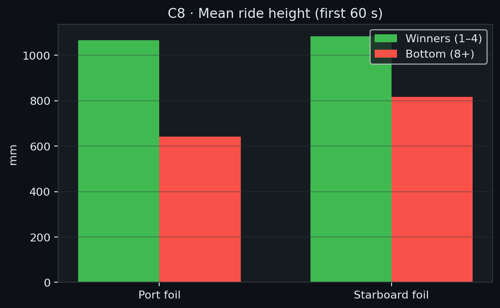
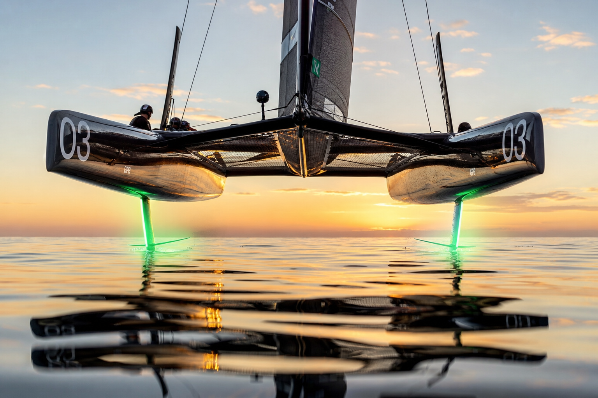
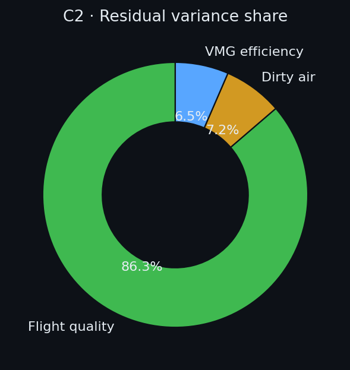
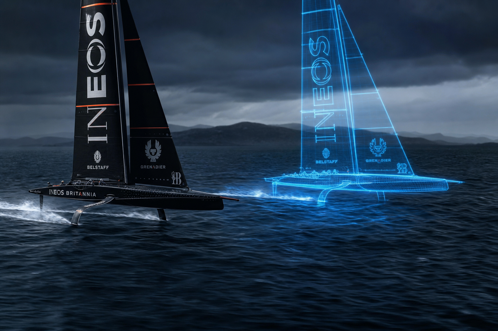
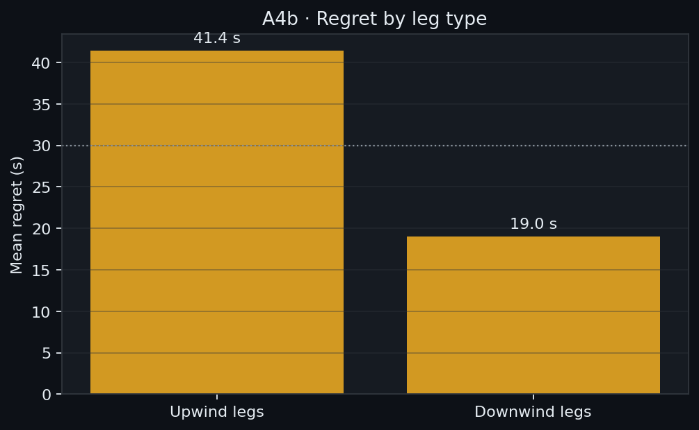
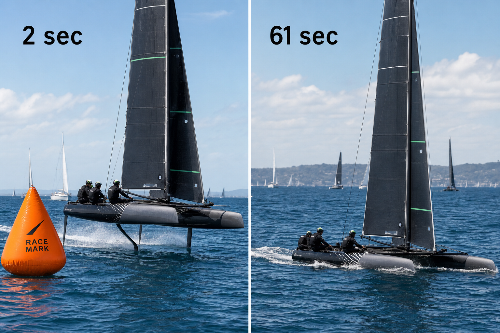
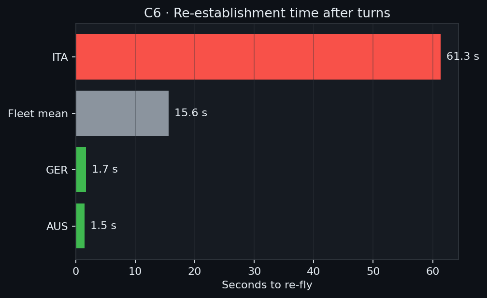
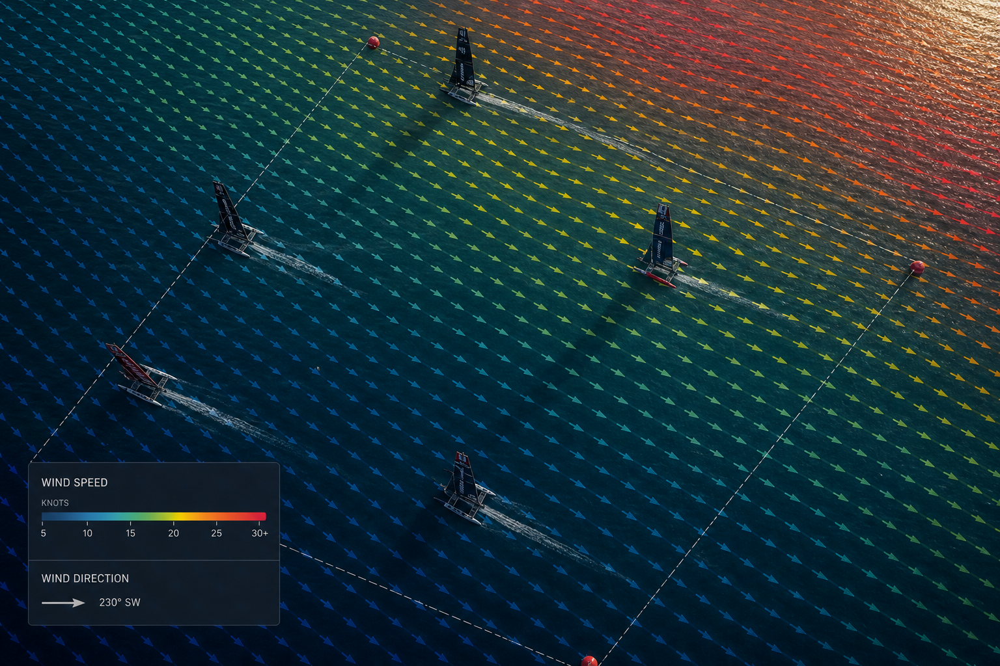

# The race is decided in the first 60 seconds

**Foil Forward · Stream #2: On the Water** · Ocean of Data Challenge · June 2026

Four experiments, one causal chain — built from F50 telemetry (Bermuda 2026, 8 races + Halifax 2024, 6 races).  
**Full write-up:** open [`race-decided-in-60-seconds.html`](race-decided-in-60-seconds.html) in a browser.

---

## C8 · The first 60 seconds

Within 20 s of the gun, eventual top-4 boats fly ~40 cm higher and 15 km/h faster — before any tactical choices. **11/12** sensor gaps survive wind-speed control.

| +15.3 km/h | +425 mm port foil | 11/12 gaps | 116 start windows |
|------------|-------------------|------------|-------------------|

  

   
  <em>Source: SailGP race data</em>

---

## C2 · Flight quality drives the gap

After leg-length control (74.8% of raw variance), flight quality explains **86.3%** of the controllable gap. Dirty air + VMG efficiency ≈ 14%.

  

   
  <em>Source: SailGP race data</em>

---

## A4b · Ghost boat — fair benchmark

Per-team optimal path in each boat's wind. Total regret vs finish rank: **Spearman ρ = 0.915**. Upwind regret **2.2×** downwind. Best upwind: AUS 28.8 s.

  

   
  <em>Source: SailGP race data</em>

---

## C6 · Slow restarts after turns

Slow re-foiling after mark roundings: ITA **61 s** vs AUS **1.5 s** (~8 min lost/race). Explains **52.7%** of upwind-regret variance.

  

   
  <em>Source: SailGP race data</em>

**For coaches:** start ride height, mid-leg flight stability, restart speed after turns.

---

## Wind · Course wind field

Mark sensors interpolated across the full course (IDW) — wind speed and direction for every manoeuvre.

   
  <em>Source: SailGP race data</em>

Interactive: `dataExploration/exported/wind_field_interp_Bermuda_Race_5.html`

---

## Glossary

| Term | Meaning |
|------|---------|
| **Flight quality** | 0–1 score from ride height + foiling sensors |
| **Ghost boat** | Per-team optimal path using fleet polar + that boat's wind |
| **Regret** | Seconds lost vs ghost over a leg (actual − ghost time) |
| **Re-establishment** | Seconds until flight quality > 0.7 after a turn |

---

## Data & repo

- **Source:** [SailGP challenge dataset](https://drive.google.com/file/d/1yXLn4tzXRdJ2C-udGX4OavMSsRIeAblx/view) (local: `DataChallenge_Export/`)
- **Interactive charts:** `dataExploration/exported/` (ghost boat animation, wind field, first-minute timelines)
- **Reproduce:** `pip install -r requirements.txt` → `python scripts/build_snapshot.py`
